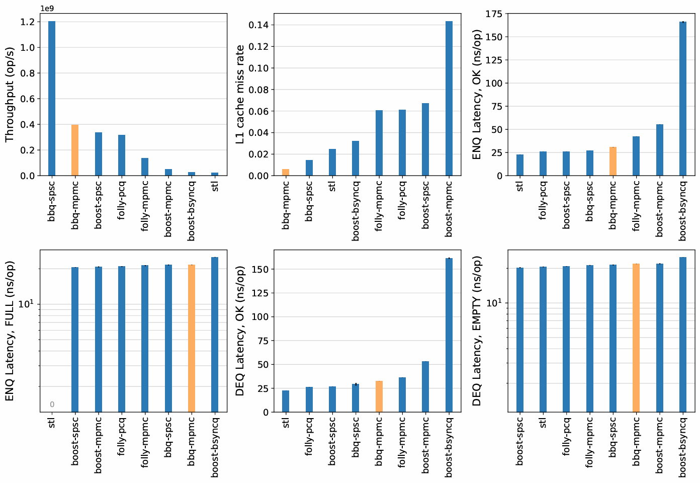
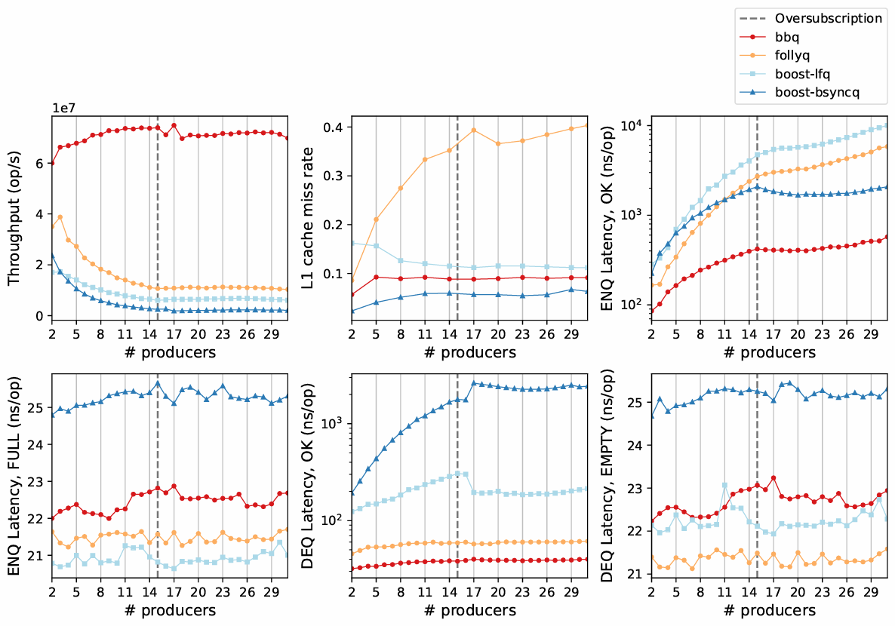
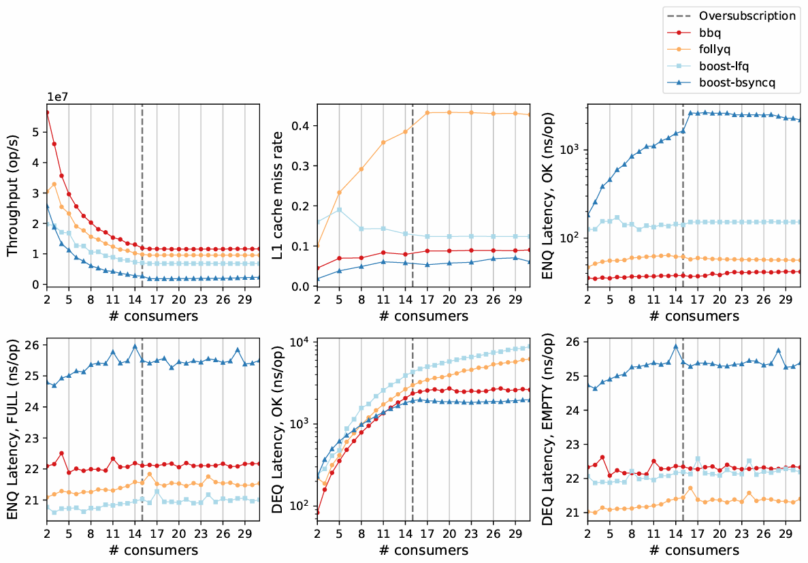

# BBQ.h

[](https://raw.githubusercontent.com/martin-r-georgiev/block-bounded-queue/master/LICENSE)

A state-of-the-art bounded multi-producer multi-consumer concurrent queue written in C++23. The experimental lock-free algorithm is based on the publication ["BBQ: A Block-based Bounded Queue for Exchanging Data and Profiling" by Wang et al. (2022)](https://www.usenix.org/conference/atc22/presentation/wang-jiawei).

## Features
- Fixed-size queue with a capacity that can be declared at runtime.
- The queue can operate in two modes: `RETRY_NEW` and `DROP_OLD`.
  - **RETRY_NEW**: In retry-new mode, producers cannot insert data when the queue is full. Depending on the queue’s implementation, they may wait indefinitely for the queue to have enough capacity to insert before completing the enqueue operation. This mode is common in most producer-consumer queues and is typically used for message passing and distributed work tasks.
  - **DROP_OLD**: In drop-old mode, producers continue to write data even if the data is not yet consumed. As a result, producers no longer need to wait for consumers to make further progress and are instead only blocked by producers with ongoing enqueue operations. As this mode is considered “lossy”, its intended use is for software profiling, tracing and/or debugging, as well as logging, in which producers should be able to overwrite unconsumed data whenever the buffer gets full.

## Usage

#### Construction
```cpp
BlockBoundedQueue<T, mode>(std::size_t block_num, std::size_t block_size);
```

Constructs a new `BlockBoundedQueue` with entries of type `T` and operational queue mode `mode`. The queue's capacity, defined at runtime, is equal to `block_num * block_size`.

- **Parameters:**
  - `T`: Type of elements.
  - `mode`: Queue operation mode (`QueueMode::RETRY_NEW` or `QueueMode::DROP_OLD`).
  - `block_num`: Number of blocks.
  - `block_size`: Size of each block.

#### Enqueue

```cpp
OpStatus enqueue(const T& data) noexcept;
```

Attempts to enqueue an element of type `T` into the queue.

- **Parameters:**
  - `data`: Element to be enqueued.

- **Returns:**
  - `OpStatus::OK` — Success.
  - `OpStatus::FULL` — Queue is full.
  - `OpStatus::BUSY` — Operation cannot proceed as the queue is busy, likely due to another ongoing operation.

#### Dequeue

```cpp
const std::pair<std::optional<T>, OpStatus> dequeue() noexcept;
```

Dequeues an element from the queue.

- **Returns:**
  A pair containing:
  - `optional<T>`: The dequeued value if successful, otherwise `std::nullopt`.
  - `OpStatus`:
    - `OpStatus::OK` — Success.
    - `OpStatus::EMPTY` — Queue is empty.
    - `OpStatus::BUSY` — Operation cannot proceed as the queue is busy, likely due to another ongoing operation.

#### Empty

```cpp
bool empty() const noexcept;
```

Checks if the queue is empty. Pending operations are ignored in this check. Entries allocated but not yet committed are not considered part of the queue. Reserved entries awaiting consumption still count as present in the queue.

- **Returns:**
  - `true` if the queue is empty, `false` otherwise.

#### Capacity

```cpp
std::size_t capacity() const noexcept;
```

Returns the maximum number of elements the queue can hold.

- **Returns:**
    - The capacity of the queue (`block_num * block_size`).

#### Size

```cpp
std::size_t size() const noexcept;
```

Returns the number of elements currently in the queue. Pending operations are ignored in this count. Entries allocated but not yet committed are not considered part of the queue. Reserved entries awaiting consumption still count as present in the queue.

- **Returns:**
    - The number of elements in the queue.

#### Clear

```cpp
void clear() noexcept;
```

Clears the queue, resetting its state.
**Remark:** This method should only be used in a single-threaded context while the queue is not in active use. In any other case, behavior is undefined and is likely to cause memory-related errors.

## Example

A minimal example demonstrating the usage of `queues::BlockBoundedQueue`. For a multi-producer multi-consumer example, please refer to the benchmark runner source code.

```cpp
#include <queue/bbq.h>
#include <iostream>

int main() {
    queues::BlockBoundedQueue<int, queues::QueueMode::RETRY_NEW> queue(8, 64);

    queue.enqueue(42);
    auto result = queue.dequeue();

    if (result.second == queues::OpStatus::OK && result.first.has_value()) {
        std::cout << "Dequeued: " << result.first.value() << std::endl;
    }
}
```

## Benchmarks

Excerpts from the benchmark results taken from the thesis paper. For detailed information on the benchmarking configuration, experiments selection, and evaluation of the results, please refer to the thesis paper, which is linked in the [**About**](#about) section below.

| Queue         | Type   | Source                                                                                      |
|---------------|--------|---------------------------------------------------------------------------------------------|
| bbq-spsc      | SPSC   | [wangjwchn/BBQ](https://github.com/wangjwchn/BBQ).                                          |
| bbq-mpmc      | MPMC   | This implementation.                                                                        |
| boost-spsc    | SPSC   | [Boost.Lockfree](https://www.boost.org/doc/libs/1_89_0/doc/html/doxygen/classboost_1_1lockfree_1_1spsc__queue.html). |
| folly-pcq     | SPSC   | [folly::ProducerConsumerQueue](https://github.com/facebook/folly/blob/main/folly/ProducerConsumerQueue.h). |
| boost-mpmc    | MPMC   | [Boost.Lockfree](https://www.boost.org/doc/libs/1_89_0/doc/html/doxygen/classboost_1_1lockfree_1_1queue.html). |
| folly-mpmc    | MPMC   | [folly::MPMCQueue](https://github.com/facebook/folly/blob/main/folly/MPMCQueue.h).          |
| boost-bsyncq  | SPSC   | [Boost.Thread](https://www.boost.org/doc/libs/master/doc/html/thread/sds.html#thread.sds.synchronized_queues.ref.sync_bounded_queue_ref). |
| stl           | MPMC   | [C++ STL queue](https://en.cppreference.com/w/cpp/container/queue.html) protected by `std::mutex` and `std::condition_variable`. |

#### Single-Producer Single-Consumer (SPSC)


#### Multi-Producer Single-Consumer (MPSC)


#### Multi-Producer Multi-Consumer (SPMC)


## TODO

- [ ] Add more queues to the benchmark test suite.
- [ ] Add visualization generation to the benchmark runner.
- [ ] Implement a version of the block-bounded queue, for which the capacity is defined at compile-time.
- [ ] Implement an iterator for the queue, which would allow for content inspection without dequeueing and enqueueing all elements again.
- [ ] Support for Microsoft Visual C++ (MSVC) compiler.
- [ ] Test on Windows and MacOS.

## About

- **Author:** Martin Georgiev // [martin-r-georgiev](https://github.com/martin-r-georgiev) // martin.r.georgiev@hotmail.com

- **MSc Thesis Paper:** [The Block-Based Bounded Queue: A Comprehensive Review of a Modern Concurrent Queue Design](https://dspace.uba.uva.nl/server/api/core/bitstreams/37ab24f5-c31a-49a6-bf45-588bf06aa2df/content).
